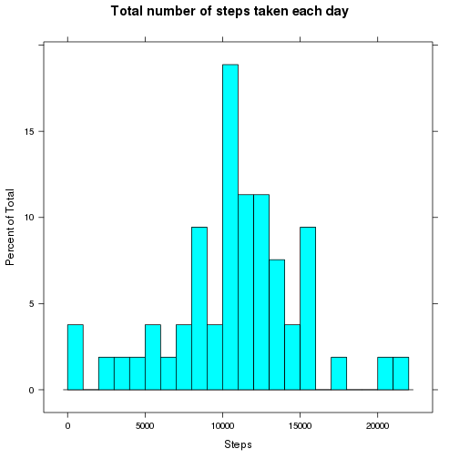
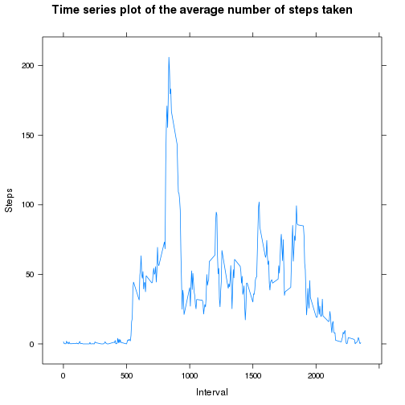
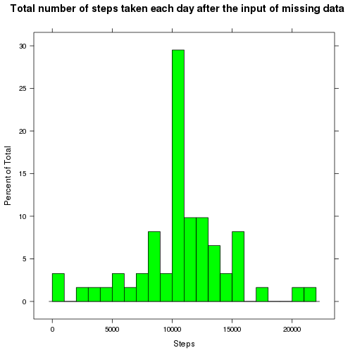
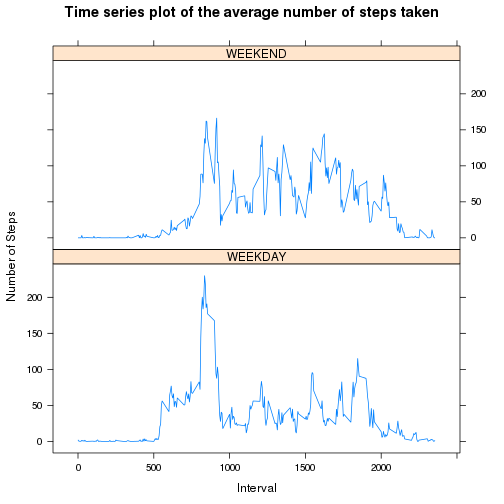

<!-- rmarkdown v1 -->
---
output: 
  html_document:
    keep_md: true
---
# Reproducible Research: Peer Assessment 1

It is now possible to collect a large amount of data about personal movement using activity monitoring devices such as a Fitbit, Nike Fuelband, or Jawbone Up. These type of devices are part of the “quantified self” movement – a group of enthusiasts who take measurements about themselves regularly to improve their health, to find patterns in their behavior, or because they are tech geeks. But these data remain under-utilized both because the raw data are hard to obtain and there is a lack of statistical methods and software for processing and interpreting the data.

This assignment makes use of data from a personal activity monitoring device. This device collects data at 5 minute intervals through out the day. The data consists of two months of data from an anonymous individual collected during the months of October and November, 2012 and include the number of steps taken in 5 minute intervals each day.

### Loading and preprocessing the data


```r
library(dplyr, quietly = TRUE)
library(lattice)
library(hash)

if (!"activity.zip"  %in% dir()) {
    download.file("https://d396qusza40orc.cloudfront.net/repdata%2Fdata%2Factivity.zip", 
        destfile = "activity.zip", method = "curl")
}

if (!"activity.csv"  %in% dir()) {
    unzip("activity.zip")
}
dataSet <- tbl_df(read.csv("activity.csv"))
dataSet$date <- as.Date(dataSet$date)
print(dataSet)
```

```
## Source: local data frame [17,568 x 3]
## 
##    steps       date interval
##    (int)     (date)    (int)
## 1     NA 2012-10-01        0
## 2     NA 2012-10-01        5
## 3     NA 2012-10-01       10
## 4     NA 2012-10-01       15
## 5     NA 2012-10-01       20
## 6     NA 2012-10-01       25
## 7     NA 2012-10-01       30
## 8     NA 2012-10-01       35
## 9     NA 2012-10-01       40
## 10    NA 2012-10-01       45
## ..   ...        ...      ...
```

### What is mean total number of steps taken per day?


```r
cleanSet <- dataSet[complete.cases(dataSet),]
aggregateStepsByDay <- aggregate(cleanSet$steps, by=list(day=cleanSet$date), FUN=sum)
histogram(aggregateStepsByDay$x,
          type="percent",
          xlab="Steps",
          breaks = 25,
          main="Total number of steps taken each day")
```



### Mean and median number of steps taken each day

```r
mean(aggregateStepsByDay$x)
```

```
## [1] 10766.19
```

```r
median(aggregateStepsByDay$x)
```

```
## [1] 10765
```

## What is the average daily activity pattern?


```r
cleanSet <- dataSet[complete.cases(dataSet),]
aggregateStepsByInterval <- aggregate(cleanSet$steps, 
                                      by=list(Interval=cleanSet$interval), 
                                      FUN=mean)
with(aggregateStepsByInterval, xyplot(x ~ Interval, type="l",
                                      ylab="Steps",
                                      main="Time series plot of the average number of steps taken"))
```



### The 5-minute interval that, on average, contains the maximum number of steps


```r
maxMean <- max(aggregateStepsByInterval$x)
for (idx in 1:nrow(aggregateStepsByInterval)) {
    
    if (aggregateStepsByInterval[idx, "x"] == maxMean) {
        
        print(aggregateStepsByInterval[idx, "Interval"])
    }
}
```

```
## [1] 835
```

## Imputing missing values

### Total number of missing values in the dataset

```r
missingSet <- tbl_df(dataSet[!complete.cases(dataSet),])
missingSet
```

```
## Source: local data frame [2,304 x 3]
## 
##    steps       date interval
##    (int)     (date)    (int)
## 1     NA 2012-10-01        0
## 2     NA 2012-10-01        5
## 3     NA 2012-10-01       10
## 4     NA 2012-10-01       15
## 5     NA 2012-10-01       20
## 6     NA 2012-10-01       25
## 7     NA 2012-10-01       30
## 8     NA 2012-10-01       35
## 9     NA 2012-10-01       40
## 10    NA 2012-10-01       45
## ..   ...        ...      ...
```

###  Filling the missing values in the dataset. 
The strategy is to use the mean of every 5-minute interval

```r
myHash <- hash(aggregateStepsByInterval$Interval,aggregateStepsByInterval$x)
intervals <- 1:nrow(missingSet)
for (idx in intervals) {
    intValue <- as.integer(values(myHash, keys=missingSet[idx,]$interval))
    missingSet[idx,]$steps <- intValue
}
dataSetWithMissing <- bind_rows(cleanSet, missingSet)
dataSetWithMissing <- dataSetWithMissing[order(dataSetWithMissing$date),]
dataSetWithMissing
```

```
## Source: local data frame [17,568 x 3]
## 
##    steps       date interval
##    (int)     (date)    (int)
## 1      1 2012-10-01        0
## 2      0 2012-10-01        5
## 3      0 2012-10-01       10
## 4      0 2012-10-01       15
## 5      0 2012-10-01       20
## 6      2 2012-10-01       25
## 7      0 2012-10-01       30
## 8      0 2012-10-01       35
## 9      0 2012-10-01       40
## 10     1 2012-10-01       45
## ..   ...        ...      ...
```

###  Histogram and mean of the new dataset. 
After the insertion of missing values there is change in the median and in the mean value, and the percentage of total number of steps taken around the mean value now is bigger. 


```r
aggregateStepsByDayNew <- aggregate(dataSetWithMissing$steps, by=list(day=dataSetWithMissing$date), FUN=sum)

histogram(aggregateStepsByDayNew$x,
          type="percent",
          xlab="Steps",
          breaks = 25,
          col = "green",
          main="Total number of steps taken each day after the input of missing data")
```



```r
mean(aggregateStepsByDayNew$x)
```

```
## [1] 10749.77
```

```r
median(aggregateStepsByDayNew$x)
```

```
## [1] 10641
```

## Are there differences in activity patterns between weekdays and weekends?


```r
isweekend <- c("Saturday","Sunday")
dataSetWithMissing$type <- weekdays(dataSetWithMissing$date) %in% isweekend
dataSetWithMissing$type <- as.factor(dataSetWithMissing$type)
levels(dataSetWithMissing$type) <- c("WEEKDAY","WEEKEND")
aggregateStepsByIntervalDayType <- aggregate(dataSetWithMissing$steps, 
                                             by=list(Interval=dataSetWithMissing$interval, 
                                                     DayType=dataSetWithMissing$type), 
                                             FUN=mean)

with(aggregateStepsByIntervalDayType, xyplot(x ~ Interval|DayType, type="l",
                                      ylab="Number of Steps",
                                      layout=c(1,2),
                                      main="Time series plot of the average number of steps taken"))
```



The time series plot of the average number of steps taken, shows a different pattern between  the weekend and the weekdays.
